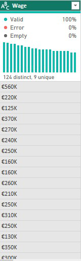
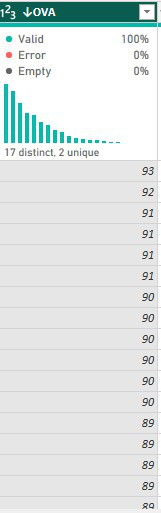

# FIFA21-Data-Cleaning

## Introduction
Data cleaning is the process of identifying and correcting or removing errors, inconsistencies, and inaccuracies in data. It is an important step in the data analytics process because it ensures that the data used for analysis is accurate, consistent, and reliable.This documentation outlines the data cleaning process for the FIFA 21 dataset, which was obtained from Kaggle. The raw data file was named "fifa21 raw data v2.csv" and was provided as part of a Data Cleaning Challenge for data analysts of all levels. The data cleaning process was completed using Power Query, a powerful data transformation tool. The purpose of this project was to clean and prepare the dataset for further analysis.The objective of the data cleaning process was to ensure the dataset was accurate, consistent, and formatted in a way that is easy to work with.
**_Disclaimer_** : _This datasets and reports do not represent any company, institution or country but just a dummy dataset to demonstrate capabilities of Power BI._

## Data Cleaning Processes
The first step was be to load the dataset into Power Query. This was done by going to the  “Get Data” in Power BI selecting “From Text/CSV” and imported the file. Once the file was loaded, I selected transform data it appeared in the Power Query Editor.
During the data cleaning process, an issue was identified with the "Photo URL" and "Player URL" columns. These columns are called Metadata ie they are not useful in our visualization.
Another important step was that i identified, handled any duplicate records in the dataset and change the data type. The first of our cleaning was done by trimming all the columns in other to remove all the extra spaces from the column.

## Contract Column
The “Contract” column contains information about when a player joined a club and when their contract ended, including free players and those on loan, which makes the column non-unique. To address this, two new columns were created: one to calculate the duration of a player’s contract and the other to indicate the type of agreement the player was under.

Before Column            |     After Column
:-----------------------:|:---------------------:
 |

## Height column
The ‘Height’ column in the dataset contains measurements in different units such as cm, inches, and feet. To standardize the units, i converted all the measurements to cm and the following steps were taken to address this issue:

Identified all entries in ft/in format using the Text.Contains function.
Separated the feet and inches values using the Text.BetweenDelimiters function.
Converted the feet value to centimeters by multiplying by 30.48.
Converted the inches value to centimeters by multiplying by 2.54.
Added the converted feet and inches values to get the final height in centimeters (cm).

Before Column           |     After Column
:----------------------:|:--------------------:
  |  

let 
    cm = if Text.Contains([Height], "cm") then 
            Number.From(Text.BeforeDelimiter([Height], "cm")) 
         else 
            null,
    ft = Number.From(Text.BeforeDelimiter([Height], "'")),
    inch = Number.From(Text.BetweenDelimiters([Height], "'", """)),
    Result = if cm is null then (ft*30.48) + (inch*2.54) else cm
in
    Result

## Weight Column
The Weght column contains measurements in both kilograms and pounds(lbs), which we will convert to pounds(lbs) to have a uniform unit of measurement across the column. This process will enable us to have a more consistent and accurate dataset, facilitating further analysis.

Before Column             |        After Column
:------------------------:|:---------------------:
    |  

if Text.Contains([Weight], "kg") then
    Number.From(Text.BeforeDelimiter([Weight], "kg")) * 2.204
else
    Number.From(Text.BeforeDelimiter([Weight], "lbs"))
    
   ##Value, Wages and Release Clause Columns Transformation
   The Value’, ‘Wage’, and ‘Release Clause’ columns will be converted from string to numeric format. For instance, the “M” column signifies million, while “K” denotes thousand. Moreover, The currency was converted from euros to dollars using the current exchange rate. The euro currency symbol “€” was removed with an empty string in the “Value”, “Wage”, and “Release Clause” columns.
   
   Value Column
   if Text.Contains([Value], "M") then
    Number.From(Text.BeforeDelimiter([Value], "M")) * 1000000 * 1.06
else
    Number.From(Text.BeforeDelimiter([Value], "K")) * 1000 * 1.06
   
   before column        |     After column
   :-------------------:|:-----------------:
   |
   
   Wage Column
   if Text.Contains([Wage], "K") then 
    Number.From(Text.BeforeDelimiter([Wage], "K")) * 1000 * 1.06
else
    Number.From([Wage]) * 1.06
   
   before column       |     after column
   :------------------:|:----------------:
   |
   
Release column

 before column               |     after column
:---------------------------:|:--------------------------:

|

(if Text.Contains([Release Clause], "M") then
    Number.From(Text.BeforeDelimiter([Release Clause], "M")) * 1000000
else
    Number.From(Text.BeforeDelimiter([Release Clause], "K")) * 1000) * 1.06)
    
 ## Hits column
The ‘Hit’ column had values expressed in thousands and indicated by the letter “K” . To convert these values to whole numbers, I removed the “K” and multiplied the remaining value by 1000, and then updated the column with the resulting values.
    
 before column      |     after column
 :-----------------:|:----------------:
 |
    
 To convert these values to whole numbers, the following code was used.
 
 if Text.Contains([Hit], "K") then 
    Number.From(Text.BeforeDelimiter([Hit], "K")) * 1000
else
    Number.From([Hit])
    
## OVA and POT columns
These columns were intended to contain percentage values, but the data was entered as text instead of numeric data. I converted both columns into percentage by multiplying each rows by 100 then i changed back my data type to percentage(%)

Ova Column

before column      |     after column
:-----------------:|:----------------:
|

Pot Column

before column      |     after column
:-----------------:|:----------------:
|

## Conclusion
this dataset has undergone several transformations to clean and prepare it for analysis. Through these transformations, we were able to remove irrelevant columns, fix inconsistencies in data types, handle missing values, and convert measurement units to a standardized format.The insights drawn from the project highlight the importance of thorough data cleaning processes in ensuring the accuracy and reliability of datasets for further analysis. The cleaned dataset can now be used for further analysis, modeling, and visualization.
   
   
   
    
